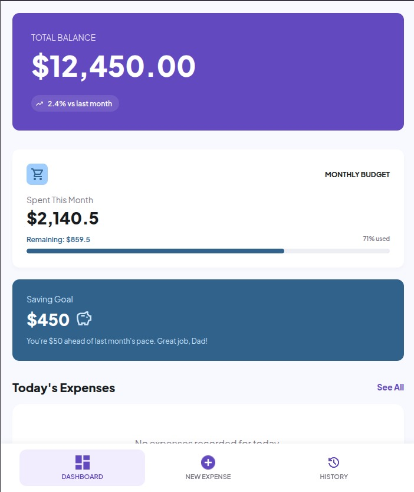
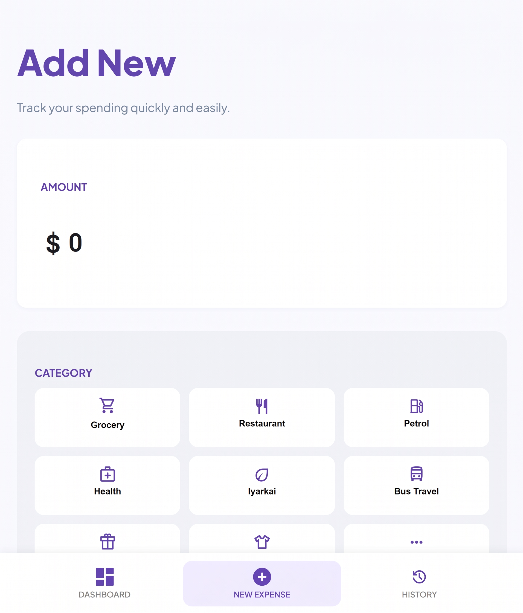
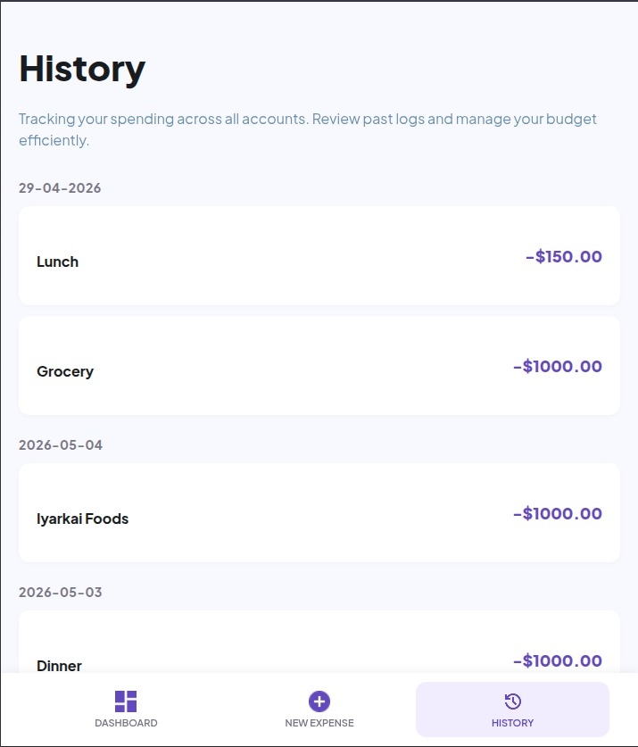

# 💰 ExpenseTracker

A sleek, modern expense tracking application built with **Svelte 5**, **SvelteKit**, and **Firebase Firestore**. Manage your daily spending with a clean, intuitive interface designed for both speed and clarity.

## ✨ Features

- **📊 Dynamic Dashboard:** Get an immediate overview of your total balance and current day's expenses.
- **➕ Quick Logging:** Add new expenses in seconds with categorized entries and descriptions.
- **📅 Transaction History:** A detailed, date-grouped log of all your past spending.
- **📱 Responsive UI:** Optimized experience for mobile and desktop using modern Vanilla CSS.
- **🔥 Real-time Backend:** Powered by Firebase Firestore for seamless data persistence and synchronization.

## 🖼️ Screenshots

### Dashboard


<br/>

### Add New Expense


<br/>

### Transaction History


<br/>

## 🛠️ Tech Stack

- **Framework:** [Svelte 5](https://svelte.dev/) (Runes API)
- **Meta-framework:** [SvelteKit](https://kit.svelte.dev/)
- **Backend:** [Firebase Firestore](https://firebase.google.com/products/firestore)
- **Styling:** Vanilla CSS (Modern UI/UX)
- **Language:** TypeScript

## 🚀 Getting Started

Follow these steps to set up the project locally.

### 1. Prerequisites
- [Node.js](https://nodejs.org/) (Latest LTS recommended)
- A Firebase project from the [Firebase Console](https://console.firebase.google.com/)

### 2. Installation
Clone the repository and install the dependencies:
```bash
git clone https://github.com/your-username/ExpenseTracker.git
cd ExpenseTracker
npm install
```

### 3. Environment Setup
Create a `.env` file in the root directory and populate it with your Firebase configuration:
```env
PUBLIC_FIREBASE_API_KEY=your_api_key
PUBLIC_FIREBASE_AUTH_DOMAIN=your_project.firebaseapp.com
PUBLIC_FIREBASE_PROJECT_ID=your_project_id
PUBLIC_FIREBASE_STORAGE_BUCKET=your_project.appspot.com
PUBLIC_FIREBASE_MESSAGING_SENDER_ID=your_sender_id
PUBLIC_FIREBASE_APP_ID=your_app_id
```

### 4. Firestore Rules
Configure your Firestore security rules to allow access:
```rules
rules_version = '2';
service cloud.firestore {
  match /databases/{database}/documents {
    match /expenses/{date} {
      allow read, write: if true;
    }
  }
}
```

### 5. Running the App
Start the development server:
```bash
npm run dev
```
Open [http://localhost:5173](http://localhost:5173) in your browser to see the app.

## 📄 License
This project is licensed under the [MIT License](LICENSE).
